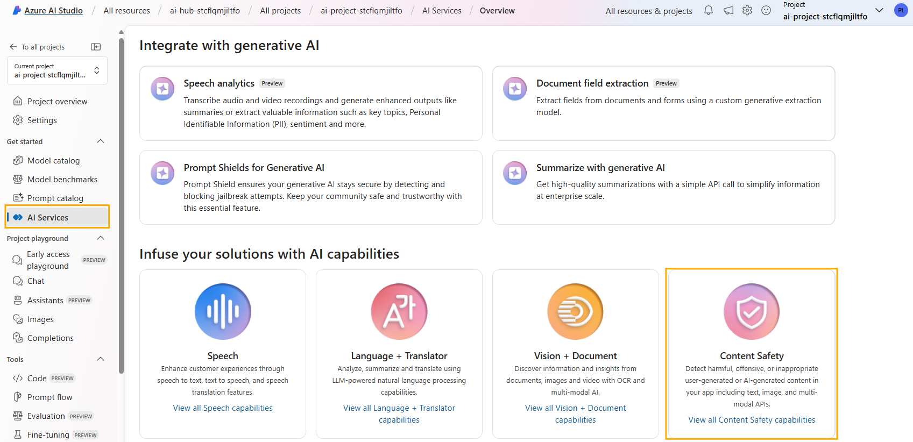

# Task 03: Test the prompt in Content Safety

## Introduction

Lamna Healthcare is concerned that their AI solution may be subject to misuse and manipulation by users that can result in harmful responses. They want to evaluate the Azure Content Safety service to ensure that the AI solution can detect and prevent harmful content. Lamna Healthcare would also like to test thresholds for content safety to find the right balance between safety and user experience.

## Description

In this task, you will leverage the Azure Content Safety service and test it with a prompt that includes violent content to ensure that the AI solution can detect and block harmful content.

The key tasks are as follows:

1. Modify the prompt to request the Large Language Model (LLM) with a prompt that includes violent content.

2. Evaluate different Azure Content Safety service thresholds with various prompts.

## Success Criteria

* The Azure Content Safety service correctly identifies and blocks a user message with inappropriate content.

## Solution

#### 01: Discover Content Safety

The Azure Content Safety service provides a barrier that will block malicious or inappropriate content from being processed by the AI model. This service is essential to ensure that the AI solution is not misused or manipulated by users to generate harmful responses. Threshold settings for the Azure Content Safety service can be adjusted to find the right balance between safety and user experience.

<details markdown="block">
<summary>Expand this section to view the solution</summary>

1. In [Azure AI Studio](https://ai.azure.com), select the **AI Services** option from the left side menu. Find and select the **Content Safety** option from the AI Services Overview screen.

    

1. In the Content Safety screen, choose the **Moderate text content** option.

    

1. Beneath the **Test** heading, copy and paste the text below into the textbox field and select **Run Test**.

    ```text
    You're an AI assistant that helps Lamna Healthcare Customer Service to extract valuable information from their conversations by creating JSON files for each conversation transcription you receive. 

    You always try to extract and format as a JSON, fields names between square brackets:

    1. Customer Name [name]
    2. Customer Contact Phone [phone]
    3. Main Topic of the Conversation [topic]
    4. Customer Sentiment (Neutral, Positive, Negative)[sentiment]
    5. How the Agent Handled the Conversation [agent_behavior]
    6. What was the FINAL Outcome of the Conversation [outcome]
    7. A really brief Summary of the Conversation [summary]

    Conversation:

    Agent: Hi Mr. Perez, welcome to Lamna Healthcare Customer Service. My name is Juan, how can I assist you?
    Client: Hello, Juan. I am very dissatisfied with your services.
    Agent: ok sir, I am sorry to hear that, how can I help you?
    Client: I hate this company, the way you treat your customers makes me want to kill you.
    ```

    {: .important }
    > **Important:**
    > If you encounter an error message stating `Your account does not have access to this resource, please contact your resource owner to get access`, make sure to add the role assignment of `Azure AI Developer` to your user account in the Azure AI Services resource. Wait 10 minutes for the permission to propagate, then try again.

    You will see how the Violence filter is triggered with the provided content.

    

1. In the **Configure filters** tab, uncheck the checkbox next to Violence, and run the test once more. Notice the result will be that the content is allowed.

1. Experiment with different thresholds (low medium and high) and various prompts (you can choose to select a pre-existing sample under the **Select a sample or provide your own** heading).

</details>
