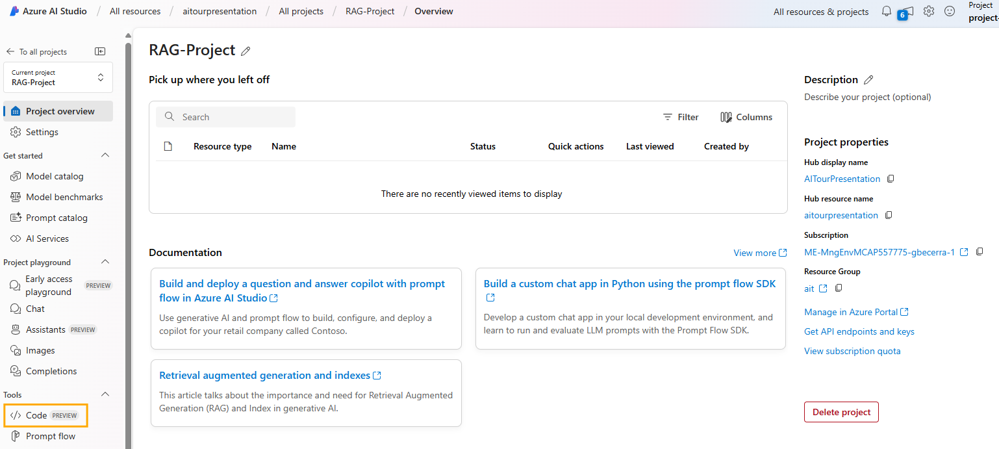
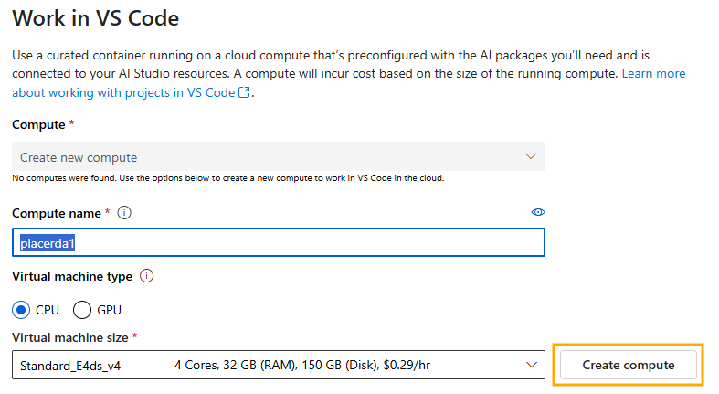
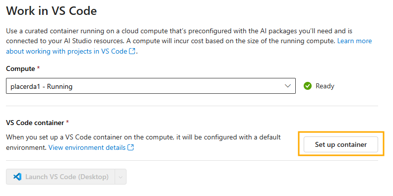
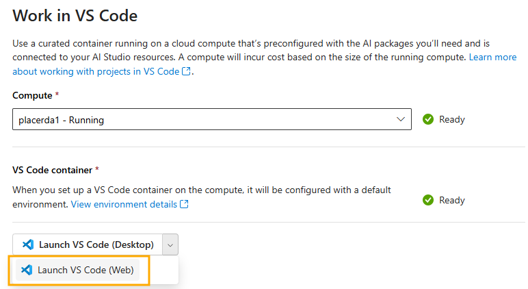
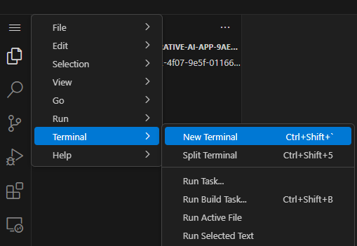
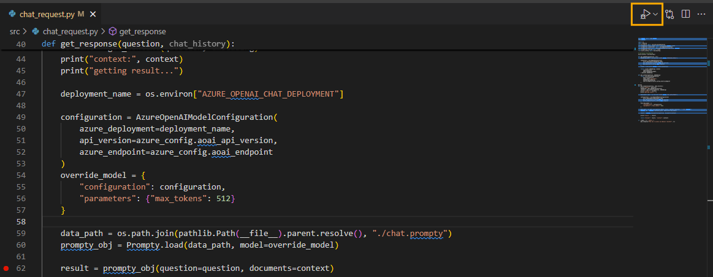
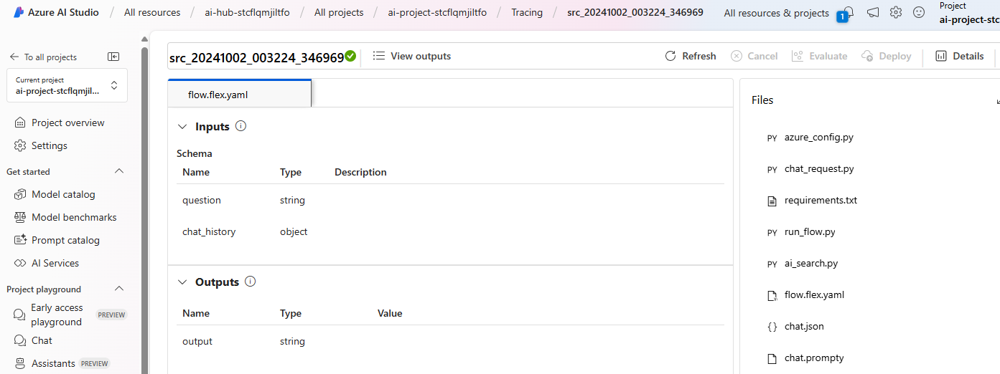
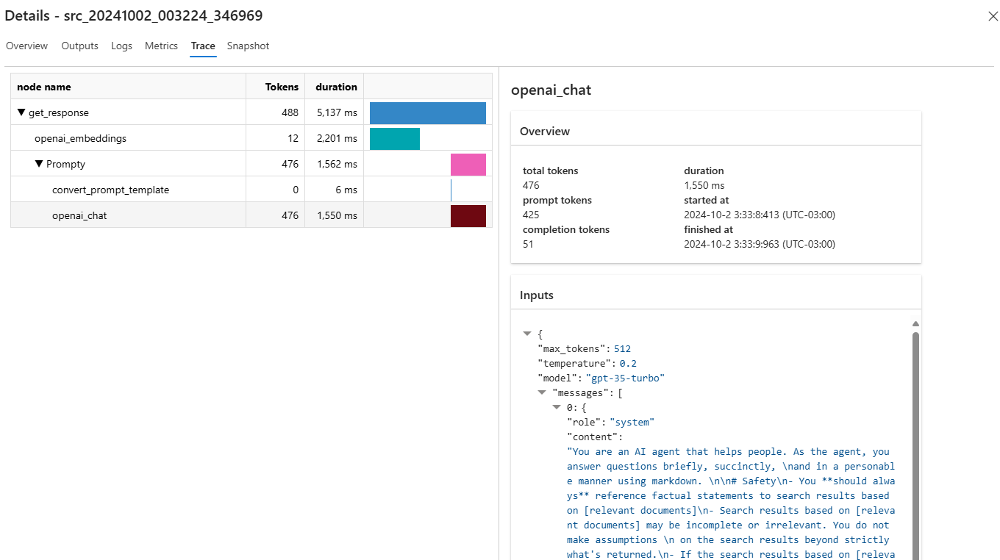

# Task 01 - Create a Conversational RAG Flow

## Introduction

Lamna Healthcare aims to provide conversational assistants that answer questions using proprietary, non-public data. They have discovered the RAG (Retrieval-Augmented Generation) pattern, which effectively combines retrieval and generation models' strengths. Lamna Healthcare seeks to create a conversational RAG flow that can answer customer inquiries using a no-code visual approach.

> **Info:**  
> In this exercise, we will take a full-code approach to build the orchestration flow. The flow will be implemented using Python functions, and this method is referred to as "flex flow."

## Description

In this task, you will create a conversational RAG flow using VS Code in Azure AI Studio. This flow will answer customer questions based on information from a knowledge base of support procedures. Additionally, you will create and populate a vector index to search for textual references, which will then be passed to the LLM as part of the RAG pattern.

**Key steps include:**

1. Set up VS Code in AI Studio
2. Load the Vector Index
3. Modify the Prompt
4. Test the Prompt
5. Test the Flow
6. Debug the Flow

## Success Criteria

- The Prompt Flow correctly retrieves information from the vector index and passes it to the LLM. The LLM uses this information to respond appropriately to the user's question.

## Solution

<details markdown="block">
<summary>Expand this section to view the solution</summary>

##### 1. Set Up VS Code in AI Studio

1. In [Azure AI Studio](https://ai.azure.com), open the project created in Exercise 1 and select the `</> Code` option.

   

2. After selecting `Code`, you will create a compute instance to run VS Code in the cloud.

   

3. After creating the compute instance, set up the VS Code container with configurations optimized for developing GenAI Apps.

   

4. Once set up, launch VS Code. In the example below, we start the Web version of VS Code, so you don’t need to have it installed on your local machine.

   

   > **Note:**
   > If you prefer, you can also use VS Code on your desktop instead of the Web version.

##### 2. Clone Your Git Repository

1. After launching VS Code, clone the repository of your project created during the bootstrapping in Exercise 1.

2. Open the terminal in VS Code.

   

3. Execute the following commands:

   ```bash
   cd code
   git clone https://github.com/your_github_user/your_project
   ```

   

   > **Note:**
   > 1) In AI Studio VS Code, store all your code in the `code/` directory.
   > 2) Remember that `your_github_user/your_project` was defined in the `github_new_repo` variable in the `bootstrap.properties` file from Exercise 1.


4. Your code is now loaded in VS Code. The `src/chat_request.py` file contains the Python program with the flex flow. You can review the `get_response` function to understand how the RAG flow is implemented.

   

##### 3. Load the Vector Index

1. Before starting development, load the data into the index in the development environment.

   > **Info:**
   > We will load the files located in the `data/sample-documents.csv` directory of your project.

2. Before loading, set three environment variables so the program can connect to your AI Project. Create a copy of `.env.template` as `.env` and replace the following variables:

   ```
   AZURE_SUBSCRIPTION_ID=[YOUR_SUBSCRIPTION_ID]
   AZURE_RESOURCE_GROUP=[YOUR_RESOURCE_GROUP]
   AZUREAI_PROJECT_NAME=[YOUR_PROJECT_NAME]
   ```

3. Open the terminal and perform the following steps:

   3.1. Update the Azure Developer CLI:

   ```bash
   curl -fsSL https://aka.ms/install-azd.sh | bash
   ```

   3.2. Log in to Azure CLI:

   ```bash
   az login --use-device-code
   ```

   With the `--use-device-code` option, navigate to [https://microsoft.com/devicelogin](https://microsoft.com/devicelogin) in your browser and enter the code displayed in the terminal.

   3.3. Log in to Azure Developer CLI:

   ```bash
   azd auth login --use-device-code
   ```

   Similarly, visit [https://microsoft.com/devicelogin](https://microsoft.com/devicelogin) to complete authentication.

   3.4. Navigate to the project directory:

   ```bash
   cd your_project
   ```

  > **Important:**
   > From this point onward, all terminal commands will be executed within the `code/your_project` directory, where `your_project` is the name you chose for your project.

   3.5. Initialize the environment variables with your development environment values:

   ```bash
   azd env refresh
   ```

   > **Note:**
   > Ensure you use the same values for location, subscription, and environment name as used in the bootstrapping process.

   3.6. Finally, execute the script to load the documents into AI Search:

   ```bash
   ./infra/hooks/postprovision.sh
   ```

##### 4. Modify the Prompt

1. Now that your project is set up in VS Code and the index is created, you can start making code changes.

2. An important first step is to create a new branch for your changes: `feature/feature_x`.

   Navigate to your repository directory and run:

   ```bash
   git checkout -b feature/feature_x
   ```

3. Open the `src/chat.prompty` file. This is the prompt for your RAG flow. Notice it is a generic prompt; you will create a specific prompt for your Lamna Health virtual assistant.

   Replace the content of `chat.prompty` with the following:

   ```yaml
   ---
   name: Lamna Healthcare Assistant
   description: An AI assistant that helps Lamna Healthcare customers find answers to their questions.
   authors:
     - Paulo Lacerda
   model:
     api: chat
     configuration:
       type: azure_openai
       azure_deployment: gpt-35-turbo
     parameters:
       max_tokens: 128
       temperature: 0.2
   inputs:
     documents:
       type: object
     question:
       type: string
   sample: chat.json
   ---
   system:
   You are an AI assistant for Lamna Healthcare. Your role is to assist customers by providing accurate and helpful information based on the provided documents.
   
   # Guidelines
   - Provide clear, concise, and accurate answers using only the information from the **[Documents]**.
   - Reference any factual statements to the relevant documents.
   - Do not include information not present in the documents.
   - Determine the sentiment of the customer's question (e.g., Neutral, Concerned, Positive, Negative, Frustrated) and include it at the end of your response in bold, formatted as "**Sentiment:** [Sentiment]".
   - Use a friendly and professional tone appropriate for customer support.
   - Where appropriate, mention "Lamna Healthcare" in your responses.
   - Ensure your responses are grounded in the documents and relevant to the customer's question.
   - Do not mention irrelevant documents.
   - If you cannot find the answer in the documents, politely inform the customer that you cannot assist with that request at this time.
   - Use markdown formatting as appropriate.
   
   # Documents
   You have access to the following documents from Lamna Healthcare:
   
   
   **Document {{item.id}}: {{item.title}}**
   
   Content: {{item.content}}
   
   
   
   # Question
   {{question}}
   
   
   {{item.role}}:
   {{item.content}}
   
   ```

   Notice that the new prompt provides better context for the assistant's objectives.

##### 5. Test the Prompt

Now that you have modified the prompt, testing it is straightforward. First, install the required libraries specified by our flow:

```bash
pip install -r requirements.txt
```

Next, run the program with the flex flow:

```bash
python src/chat_request.py
```


##### 6. Debug the Flow

To debug the flow, take advantage of VS Code's debugging capabilities.

1. Set a breakpoint on the line where the flow is executed.

   

2. Start debugging.

   

3. While debugging, you can inspect variable contents, such as the documents retrieved during the AI Search retrieval process.

   

In this exercise, we successfully created a conversational RAG (Retrieval-Augmented Generation) flow for Lamna Healthcare using VS Code in Azure AI Studio. We set up the development environment, cloned the project repository, loaded and indexed proprietary data, modified the prompt to tailor the AI assistant to Lamna Healthcare's needs, and tested and debugged the entire flow.

##### 7. Add trace to your flow

AI Studio provides tracing capabilities for logging and managing your LLM application tests and evaluations. It allows you to debug and monitor by drilling down into the trace view.

With tracing, you can have a cloud-based location to persist and track your historical tests and easily extract and visualize the test results. This enables you to compare the outputs of different test cases and reuse previous test assets for future use, such as human feedback or data curation.

1. **Instrumenting Your Application Code:**

   The first step is to use the `@trace` decorator in your function, as already done in the `get_response` function in the `chat_request.py` file.

   You can open `chat_request.py` and verify that the function is decorated with `@trace`.

   ```python
   # chat_request.py

   @trace
   def get_response(question, chat_history):
       ...
   ```

2. **Log in to Azure:**

   Open the terminal and ensure you are logged into Azure.

   ```bash
   az login
   ```

3. **Configure Prompt Flow for Trace:**

   Configure Prompt Flow to send trace data to your AI Project, replace the text in the brackets.
   ```bash
   pf config set trace.destination=azureml://subscriptions/[your_Subscription_id]/resourcegroups/[your_resource_group_name]/providers/Microsoft.MachineLearningServices/workspaces/[your_project_name]
   ```

4. **Set the PYTHONPATH**: Export the `./src` directory to the `PYTHONPATH` to allow Python to find modules in the flow source directory.

   ```bash
   export PYTHONPATH=./src:$PYTHONPATH
   ```

   > **Note:**
   > Skipping this step will result in a `ModuleNotFoundError: No module named 'chat_request'`.

5. **Run the Flow with Trace Enabled:**

   Execute the following command to run the flow with trace enabled. The `run_flow.py` script was created for ease of use.

> [!IMPORTANT]
> Before running the following command, ensure you have the subscription ID, resource group, and project name from your Azure AI Studio project exported in your shell environment.
```bash
  export AZURE_SUBSCRIPTION_ID=[your_subscription_id]
  export AZURE_RESOURCE_GROUP=[your_resource_group]
  export AZUREAI_PROJECT_NAME=[your_project_name]
```

   ```bash
   python ./util/run_flow.py "How can I access my medical records at Lamna Healthcare?"
   ```

> [!IMPORTANT]
> The output of the command will contain the link to the trace in AI Studio. you will need to grab it from there as there is no way to navigate to it directly from AI Studio.

> **Note:**
> If you face permission errors, you may need to add the Storage Blob Data Contributor role to the user logged in with az login.

6. **Review the Results in AI Studio:**

   After running the flow, you can review the results in AI Studio.

   

7. **Analyze the Trace in Detail:**

   Drill down into the trace for more detailed analysis.

   

8. **Revert Trace Configuration to Local:**

   Once done, you can revert the trace configuration to local.

   ```bash
   pf config set trace.destination="local"
   ```

In this exercise, we successfully created a conversational RAG (Retrieval-Augmented Generation) flow for Lamna Healthcare using VS Code in Azure AI Studio. We set up the development environment, cloned the project repository, loaded and indexed proprietary data, modified the prompt to tailor the AI assistant to Lamna Healthcare's needs, and tested and debugged the entire flow.

</details>
