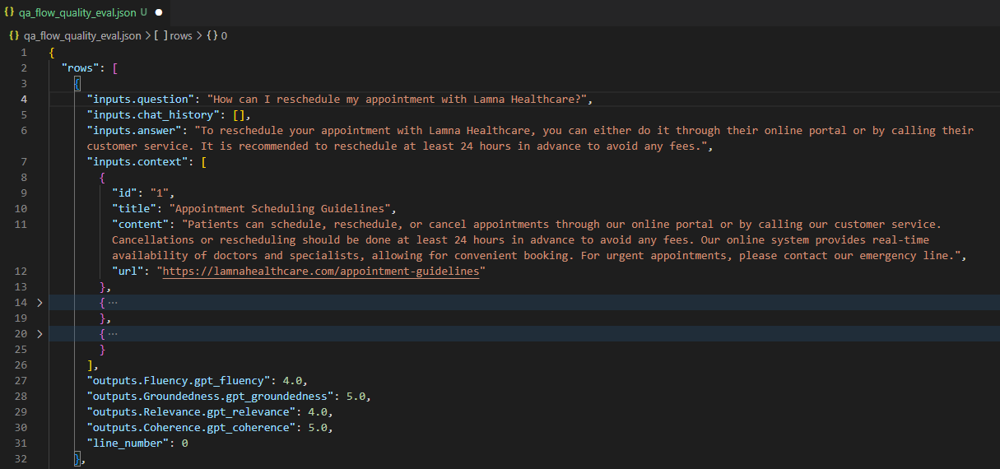
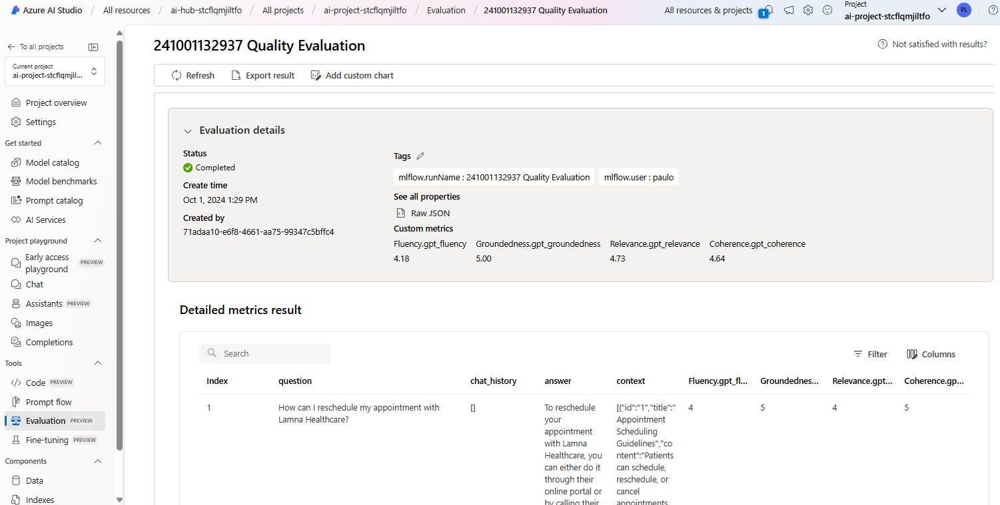

# Task 01: Evaluate your Flow

## Description

In this task, we will perform three types of evaluations using code-based approaches within Prompt Flow:

1. **Prompty Evaluation**
2. **Quality Evaluation**
3. **Safety Risk Evaluation**

Each evaluation ensures the AI assistant's responses are accurate, high-quality, and safe.

## Success Criteria

- Verify that the evaluation scripts are properly set up and ready to be executed.
- Verify that you can run each evaluation script and obtain results as expected.
- Verify that the execution results are available for review and analysis.

## GenAI Apps Evaluation Methods

Azure AI Foundry provides practitioners with tools for manual and automated evaluation that can help you with the measurement stage. We recommend that you start with manual evaluation then proceed to automated evaluation. 

Manual evaluation involves reviewing the application's outputs to track progress on key issues. It's effective for addressing specific risks by checking a small dataset until the risks are resolved. Azure AI Foundry supports manual evaluation for spot-checking small datasets.

Automated evaluation is useful for measuring quality and safety at scale with increased coverage to provide more comprehensive results. Automated evaluation tools also enable ongoing evaluations that periodically run to monitor for regression as the system, usage, and mitigations evolve.

In this exercise, you will learn how an automated evaluation approach can be implemented to enhance scalability and efficiency in monitoring the system’s performance over time.

## Solution

### Environment Variables

Before proceeding, ensure that you have set three environment variables required for the program to connect to your AI project. To do this, copy the **.env.template** file and rename it to **.env**, then replace the following variables:

```
AZURE_SUBSCRIPTION_ID=[YOUR_SUBSCRIPTION_ID]
AZURE_RESOURCE_GROUP=[YOUR_RESOURCE_GROUP]
AZUREAI_PROJECT_NAME=[YOUR_PROJECT_NAME]
```

{: .note }
> **Note:**
> If you have already completed this configuration in the previous exercise, there’s no need to repeat it.

### 01: Conduct a Prompty evaluation

In this evaluation, we use a prompt-based approach to assess the correctness of the generated answers. An AI assistant compares each answer with the ground truth for the given question and assigns a score between **1** and **5**, where **5** indicates a perfect match. The assistant also provides an explanation for the assigned score. This method leverages the capabilities of the language model to perform evaluations in a structured and consistent manner.

Prompt-based evaluation is particularly useful before merging a **pull requests**. It allows developers to quickly assess the correctness and quality of the AI assistant's responses before merging changes into the main codebase. By incorporating this evaluation during code reviews, teams can ensure that updates maintain or improve the performance of the AI system.

<details markdown="block">
<summary>Expand this section to view the solution</summary>

To execute the prompt-based evaluation, follow these steps:

1. Open a terminal and navigate to the root directory of your project.

1. Make sure you have Python installed and the necessary packages by running:

   ```bash
   pip install -r requirements.txt
   ```

1. Export the **./src** directory to the **PYTHONPATH** to allow Python to find modules in the flow source directory.

   ```bash
   export PYTHONPATH=./src:$PYTHONPATH
   ```

   {: .note }
   > Skipping this step will result in a `ModuleNotFoundError: No module named 'chat_request'`.

1. Execute the following execution script command:

   ```bash
   python evaluations/prompty_eval.py
   ```

   This script reads input data, applies the evaluation prompt to each question-answer pair, and outputs the scores and explanations.

   {: .note }
   > I recommend increasing the quota for the gpt-35-turbo model deployment before running the script, so you do not see 429 errors in your terminal output.

#### Evaluation Execution Results

*After running the script, you should see output similar to the following:*

```
                                     inputs.question                                      inputs.answer  ... outputs.score                                outputs.explanation
0  How can I reschedule my appointment with Lamna...  You can reschedule your appointment with Lamna...  ...             5  The answer provides the correct methods to res...
1  Does Lamna Healthcare share my personal inform...  Lamna Healthcare does not share your personal ...  ...             5  The answer accurately reflects the ground_trut...
2  What are my responsibilities as a patient at L...  As a patient at Lamna Healthcare, your respons...  ...             5  The answer accurately lists the responsibiliti...
3  How long does it take to process an insurance ...  The processing time for an insurance claim at ...  ...             5  The answer accurately reflects the processing ...
4  Where can I find information about my prescrib...  You can find information about your prescribed...  ...             5  The answer provides comprehensive information ...
5  Are telehealth services covered by insurance a...  Yes, telehealth services are covered by most i...  ...             5  The answer accurately reflects the ground trut...
6  What should I do if I need to discuss my billi...  If you need to discuss your billing concerns, ...  ...             5  The answer accurately covers the key points me...
7  What should I do if I have a non-life-threaten...  If you have a non-life-threatening urgent medi...  ...             3  The answer suggests calling a nurse hotline, w...
8  How can I request a refill for my prescription...  You can request a refill for your prescription...  ...             5  The answer provides the same methods for reque...
9  How does Lamna Healthcare protect my personal ...  Lamna Healthcare protects your personal health...  ...             5  The answer accurately reflects the ground_trut...
```

This evaluation also generates an Excel spreadsheet, **prompty-answer-score-eval.xlsx**, with the results.


</details>

### 02: Conduct a quality evaluation

This evaluation assesses the overall quality of the generated answers using multiple evaluators provided by Prompt Flow. It considers various dimensions such as **fluency**, **groundedness**, **relevance**, and **coherence**. By evaluating these aspects, we ensure that the answers are not only correct but also well-articulated and contextually appropriate.

Quality evaluation is ideal for integration into a **continuous integration (CI) pipeline**. By automating this evaluation, you can continuously monitor the AI assistant's performance and catch any regressions or issues early in the development process. Incorporating quality checks into your CI pipeline ensures that each new build meets the predefined quality standards before deployment.

<details markdown="block">
<summary>Expand this section to view the solution</summary>

To perform the quality evaluation:

{: .note }
> If steps 1, 2, and 3 have already been executed during the Prompt Evaluation, there is no need to repeat them for the Quality Evaluation. You can proceed directly to running the evaluation script.

1. Open a terminal and navigate to the root directory of your project.

1. Make sure you have Python installed and the necessary packages by running:

   ```bash
   pip install -r requirements.txt
   ```

1. Export the **./src** directory to the **PYTHONPATH** to allow Python to find modules in the flow source directory.

   ```bash
   export PYTHONPATH=./src:$PYTHONPATH
   ```

1. Execute the following evaluation script command:

   ```bash
   python evaluations/qa_quality_eval.py
   ```

   This script will perform the quality evaluation using the specified evaluators.

   {: .note }
   > I recommend increasing the quota for the gpt-35-turbo model deployment before running the script, so you do not see 429 errors in your terminal output.

#### Evaluation Results

*After running the script, you should see output similar to the following:*

```
...
Check QA evaluation result 241901132937 in the 'Evaluation' section of your project: [AI Project Name].
```

A file named **qa_flow_quality_eval.json** will be generated, containing the evaluation results.



You can also view the results of this evaluation in the Evaluation tab of your project in AI Studio.



</details>

### 03: Perform safety risk evaluation

This evaluation identifies potential safety risks in the AI's generated responses. Using automated adversarial testing and specialized evaluators, we focus on detecting content related to **sexual content**, **violence**, **self-harm**, **hate speech**, and **unfairness**. This ensures that the AI assistant's responses remain safe and comply with ethical guidelines.

Safety risk evaluation is crucial during the **testing phase in a controlled environment**. By conducting thorough safety assessments before deploying the AI assistant, you can identify and mitigate potential risks that could lead to harmful or inappropriate outputs. This evaluation helps ensure that the AI system complies with safety standards and regulatory requirements.

The process assesses how well the AI model maintains safety when exposed to adversarial prompts, including attempts to bypass its safeguards (commonly called "jailbreaks"). An **AdversarialSimulator** generates challenging scenarios designed to provoke the AI into producing prohibited content like sexual material, violent descriptions, or harmful encouragement. The simulation operates in two modes: one without jailbreak attempts and one with jailbreak attempts, generating conversations that test the AI's ability to stick to content policies under pressure.

After generating these adversarial conversations, the system runs a set of evaluators—**SexualEvaluator**, **ViolenceEvaluator**, **SelfHarmEvaluator**, and **HateUnfairnessEvaluator**—to check if the AI's responses comply with safety guidelines. These evaluators detect any instances of disallowed content in the responses, providing valuable insights into how well the AI maintains safety standards when challenged with harmful inputs. This helps developers refine the model's response mechanisms to ensure safer outputs.

<details markdown="block">
<summary>Expand this section to view the solution</summary>

To perform the safety risk evaluation:

{: .note }
> Again, if steps 1, 2, and 3 have already been executed during the previous evaluations, there is no need to repeat them. You can proceed directly to running the evaluation script.

1. Open a terminal and navigate to the root directory of your project.

1. Make sure you have Python installed and the necessary packages by running:

   ```bash
   pip install -r requirements.txt
   ```

1. Export the **./src** directory to the **PYTHONPATH** to allow Python to find modules in the flow source directory.

   ```bash
   export PYTHONPATH=./src:$PYTHONPATH
   ```

4. Execute the following command:

   ```bash
   python evaluations/safety_eval.py
   ```

   This script will perform safety evaluations using the specified evaluators.

   {: .note }
   > Try re-running the script if you see an error like the following:

   

#### Evaluation Results

*After running the script, you should see output similar to the following:*

```
...
Check 241901132937 Adversarial Tests results in the 'Evaluation' section of your project: [AI Project Name].
```

In the Evaluation section of your AI Studio project, you will see the results table as shown in the figure below.


Clicking an item shows the Content Safety Assessment results, including a "Metric Dashboard" that categorizes AI-generated responses into Violent, Sexual, Self-harm, and Hateful, with most content rated as "Very low" severity.


</details>

**Congratulations on completing this exercise!**

By following the steps outlined above, you have successfully:

- Set up the environment and prepared the necessary configurations.
- Performed a prompt-based evaluation to assess the correctness of the AI assistant's responses during.
- Executed a quality evaluation to ensure ongoing high-quality outputs.
- Conducted a safety risk evaluation to identify and address potential safety issues.

Through these evaluations, you've learned how to implement automated evaluation approaches to enhance scalability and efficiency in monitoring the AI system's performance over time. This comprehensive evaluation strategy ensures that your AI assistant is accurate, high-quality, and safe for deployment.
