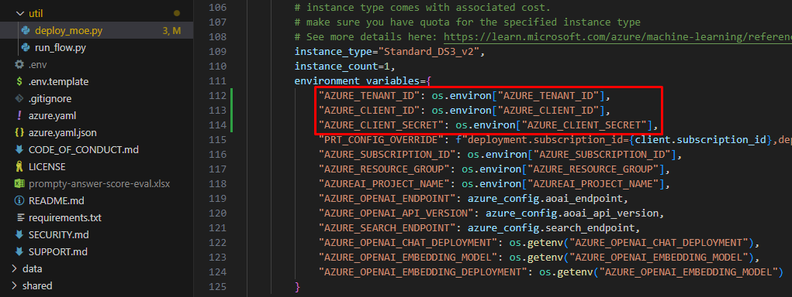
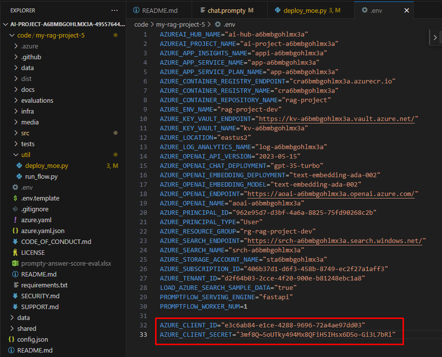
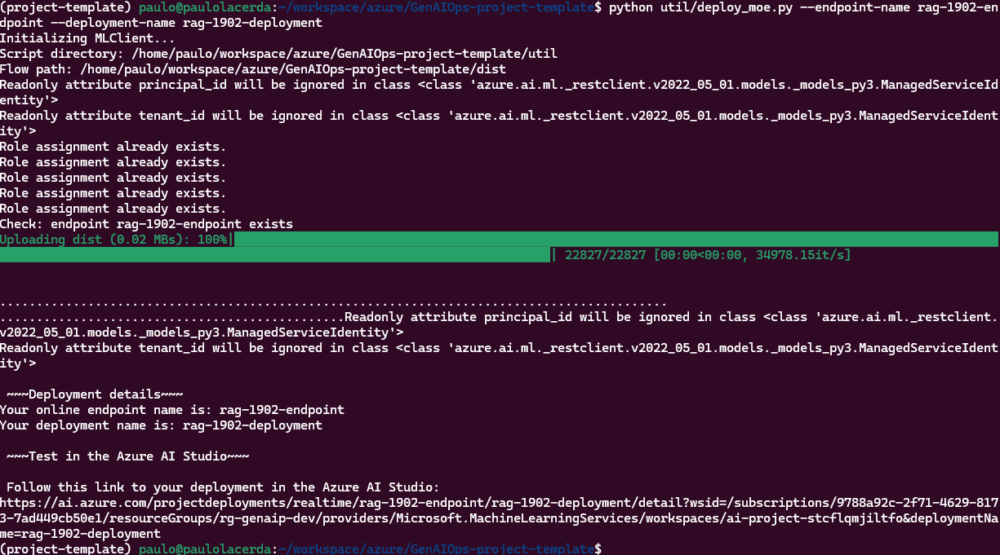
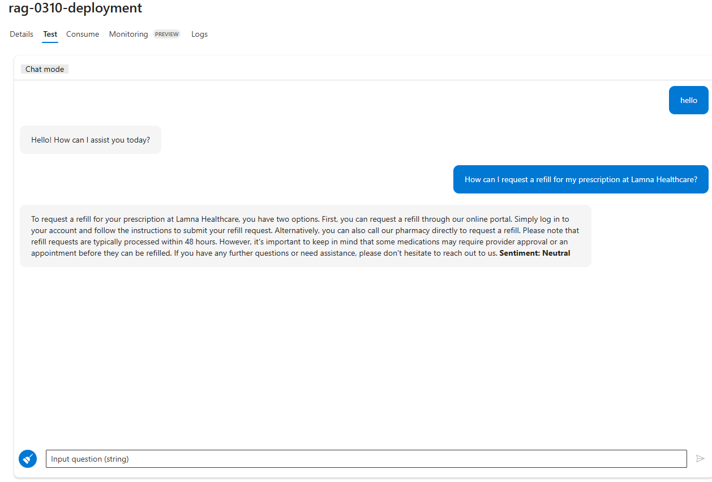

# Task 02: Deploy the RAG flow to an online endpoint

## Description

In this task, you will use the included reference instructions to deploy the RAG flow to a managed endpoint

## Success Criteria

* Successfully deploy the RAG flow to a remote endpoint 
* Verify that the deployment completes successfully
* Verify you can Test the deployment by using the endpoint on the `Test` tab

## Solution

In this task, you will deploy your application to a managed endpoint in Azure by building your flow Docker image, creating an online endpoint, and then creating a deployment in that endpoint. Finally, you will route all traffic to that deployment.

### 01: Package your flow as a Docker image

First, you need to package your flow as a model. This process will create a Dockerfile for your flow.

<details markdown="block">
<summary>Expand this section to view the solution</summary>

1. Open a terminal in the root directory of your project.

2. Run the following command to build your flow and create a Docker image:

   ```bash
   pf flow build --source src --output dist --format docker
   ```

   This command packages your flow and outputs it in the `dist` directory in Docker format.

</details>

### 02: Set the PYTHONPATH environment variable

To allow Python to find modules in the flow source directory, you need to set the `PYTHONPATH` environment variable.

<details markdown="block">
<summary>Expand this section to view the solution</summary>

1. In your terminal, run the following command:

   ```bash
   export PYTHONPATH=./src:$PYTHONPATH
   ```

{: .note }
> Skipping this step will result in a `ModuleNotFoundError: No module named 'chat_request'`.

</details>

### 03: Deploy your flow using the deployment script

Now you are ready to deploy your flow.

<details markdown="block">
<summary>Expand this section to view the solution</summary>

1. Open the deployment script: **util/deploy_moe.py**

1. Go to **util/deploy_moe.py**, line **77** and update it with the following code to configure your flow to work with the AI Studio Test Chat interface.

   ```
        model=Model(
            name="ragflow",
            path=flow_path,  # path to promptflow folder
            properties=[ # this enables the chat interface in the endpoint test tab
                ["azureml.promptflow.source_flow_id", "ragflow"],
                ["azureml.promptflow.mode", "chat"],
                ["azureml.promptflow.chat_input", "question"],
                ["azureml.promptflow.chat_output", "answer"]
            ]
        ),
   ```

1. In **util/deploy_moe.py**, under **environment_variables** on **line 111**, add the following values:

   ```
   "AZURE_TENANT_ID": os.environ["AZURE_TENANT_ID"],
   "AZURE_CLIENT_ID": os.environ["AZURE_CLIENT_ID"],
   "AZURE_CLIENT_SECRET": os.environ["AZURE_CLIENT_SECRET"],
   ```

   

1. Save changes to **deploy_moe.py**.

1. Open the **.env** file in your project folder, replace the following values and add to the file:

   ```
   AZURE_CLIENT_ID=[YOUR_SP_CLIENT_ID]
   AZURE_CLIENT_SECRET=[YOUR_SP_CLIENT_SECRET]
   ```

   

1. Save changes to **.env**.

1. In the terminal, run the following command. Be sure to replace the placeholder **XXXX** in both the **endpoint-name** and **deployment-name** with a unique four-digit number of your choice.

   ```bash
   python util/deploy_moe.py --endpoint-name rag-XXXX-endpoint --deployment-name rag-XXXX-deployment
   ```

   {: .important }
   > Both the endpoint and deployment names must be unique within your Azure region. If you see an error indicating that the name is already in use, simply choose different names. Please note, the deployment process can take several minutes to complete.

   {: .note }
   > This may take around 20 minutes to deploy.

1. Once the deployment completes, you should see output similar to the following in your terminal:

   

{: .note}
> If you receive the error "Key based authentication is not permitted on this storage account," enable the option **Allow storage account key access** in the **Configuration** section of your storage account in the Azure portal.

</details>

### 04: Testing the Deployed Flow

After completing the deployment, you can test it in **AI Studio**.

<details markdown="block">
<summary>Expand this section to view the solution</summary>

1. Go to your new deployment in **AI Studio** and open the **Test** tab. 

1. Ask a question like this:  "How can I request a refill for my prescription at Lamna Healthcare?"

   

</details>

### 05: Consuming the Deployed Flow

<details markdown="block">
<summary>Expand this section to view the solution</summary>
   
1. Navigate to your deployment in **AI Studio** and open the **Consume** tab.

1. Select the **Python** tab, then copy the example code.

   

1. Save it as a **test.py** file in the **./local** directory within your repository.

1. Before running the program, update the **test.py** file with the **request data** and your **deployment API key** for accessing the deployment.

   

   Request data:

   ```json
   {
     "question": "How can I request a refill for my prescription at Lamna Healthcare?",
     "chat_history": []
   }
   ```

1. Now, you're ready to run the **test.py** program.

   ```bash
   python local/test.py
   ```

   

</details>

**Congratulations!** You have successfully deployed your flow to a managed endpoint. You can now integrate this endpoint into your applications or services, allowing you to leverage the power of your RAG (Retrieval-Augmented Generation) flow in a scalable and reliable manner.