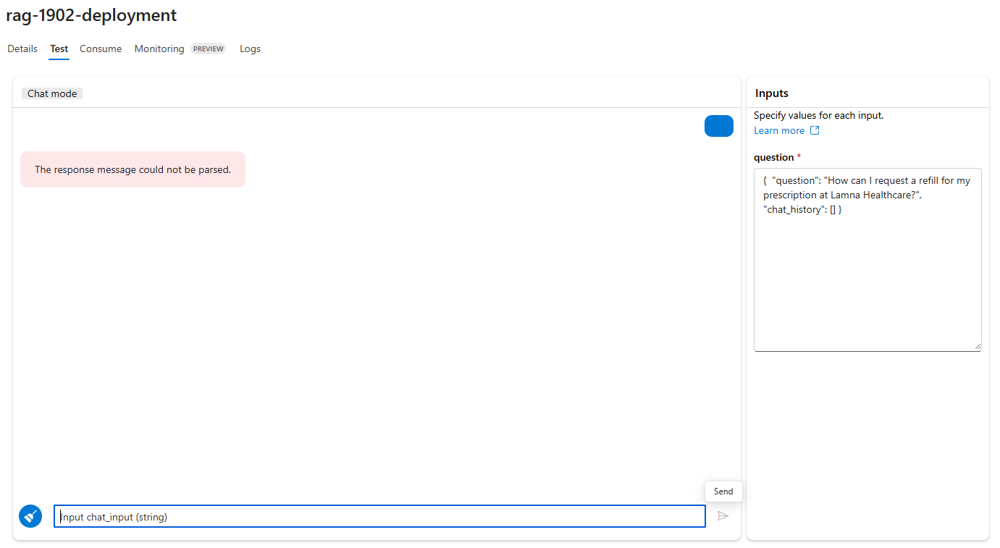
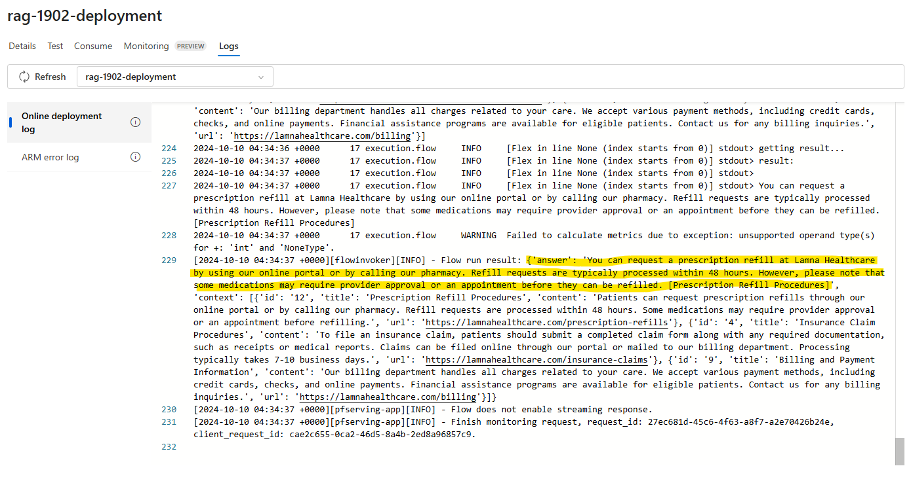
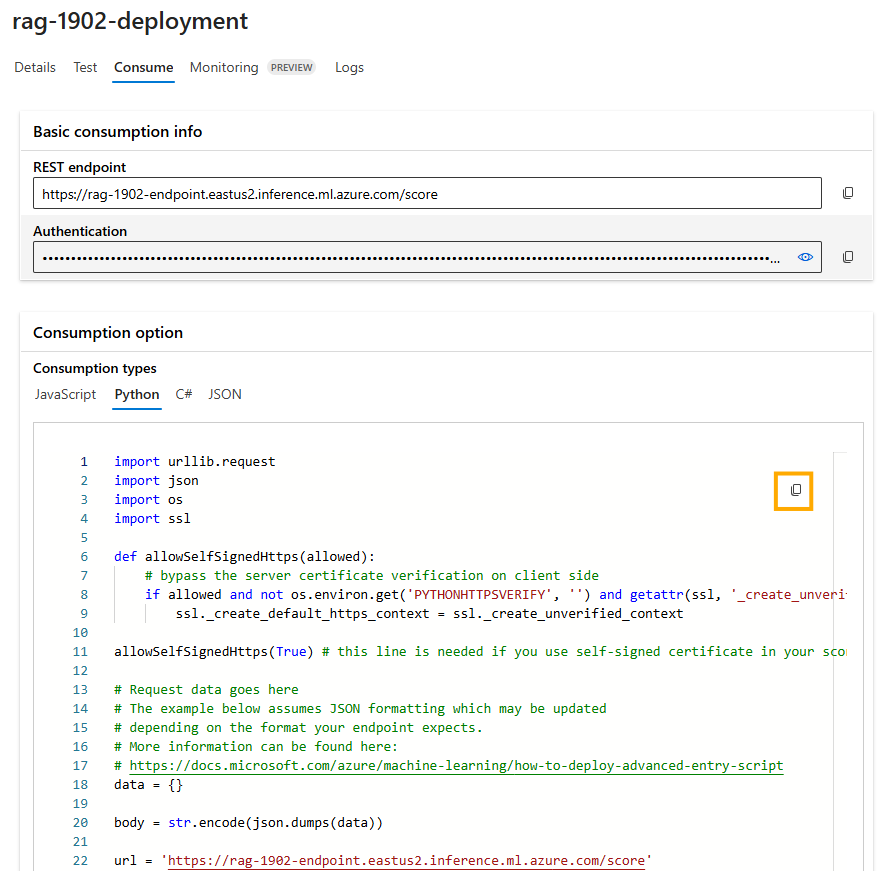

# Task 02 - Deploy the RAG flow to an online endpoint

## Description

In this task, you will use the included reference instructions to deploy the RAG flow to a managed endpoint

## Success Criteria

* Successfully deploy the RAG flow to a remote endpoint 
* Verify that the deployment completes successfully
* Verify you can Test the deployment by using the endpoint on the `Test` tab

<details markdown="block">

<summary>Expand this section to view the solution</summary>

### 1) Deploy the RAG flow to an online managed endpoint via SDK

In this task, you will deploy your application to a managed endpoint in Azure by building your flow Docker image, creating an online endpoint, and then creating a deployment in that endpoint. Finally, you will route all traffic to that deployment.

#### Step 1: Package your flow as a Docker image

First, you need to package your flow as a model. This process will create a Dockerfile for your flow.

1. Open a terminal in the root directory of your project.

2. Run the following command to build your flow and create a Docker image:

   ```bash
   pf flow build --source src --output dist --format docker
   ```

   This command packages your flow and outputs it in the `dist` directory in Docker format.

#### Step 2: Set the PYTHONPATH environment variable

To allow Python to find modules in the flow source directory, you need to set the `PYTHONPATH` environment variable.

1. In your terminal, run the following command:

   ```bash
   export PYTHONPATH=./src:$PYTHONPATH
   ```

> **Note:**
> Skipping this step will result in a `ModuleNotFoundError: No module named 'chat_request'`.


#### Step 3: Deploy your flow using the deployment script

Now you are ready to deploy your flow.

1. In the terminal, execute the following command:

   ```python
        python util/deploy_moe.py --endpoint-name rag-0000-endpoint --deployment-name rag-0000-deployment
   ```

  > **Important:**
  > The endpoint and deployment names must be unique within an Azure region. If you encounter an error indicating that the endpoint or deployment name already exists, try using different names. Note that this deployment process may take several minutes. 


2. Once the deployment completes, you should see output similar to the following in your terminal:

   


  > **Note:**
  > If you receive the error "Key based authentication is not permitted on this storage account," enable the option **Allow storage account key access** in the **Configuration** section of your storage account in the Azure portal.


### Step 4: Testing the Deployed Flow

After completing the deployment, you can test it in **AI Studio**.

Use a payload like this:

```json
{
  "question": "How can I request a refill for my prescription at Lamna Healthcare?",
  "chat_history": []
}
```

Navigate to your deployment in **AI Studio** and open the **Chat** tab. While this interface can be used for testing, it's not the most suitable for non-conversational models, as illustrated in the following images:





#### Step 5: Consume the deployed flow

For optimal testing and to obtain a Python code example, follow these steps:

First, copy the example code.



Then, save it as a `test.py` file in the `./local` directory within your repository.

Before running the program, update the `test.py` file with the request data and your deployment API key for accessing the deployment.


Now, you're ready to run the `test.py` program.


**Congratulations!** You have successfully deployed your flow to a managed endpoint. You can now integrate this endpoint into your applications or services, allowing you to leverage the power of your RAG (Retrieval-Augmented Generation) flow in a scalable and reliable manner.

</details>