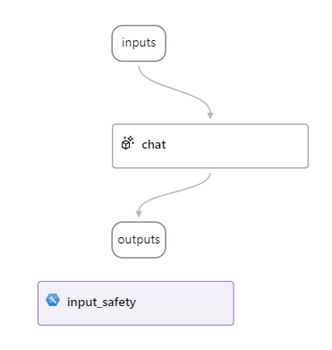
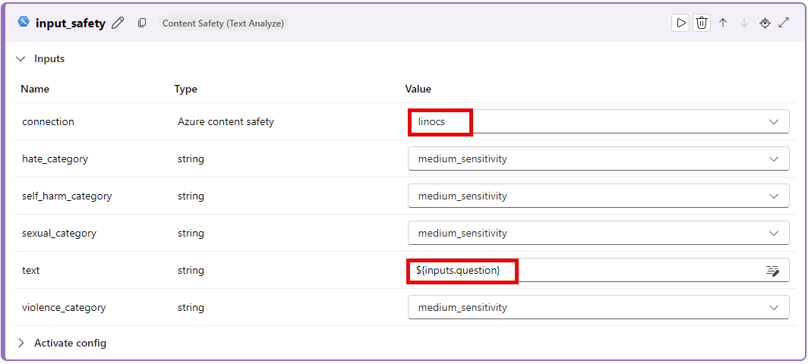
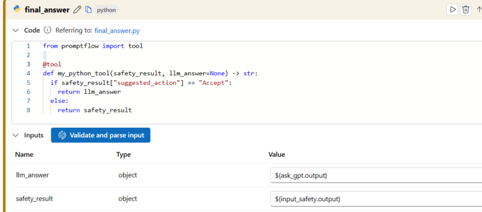
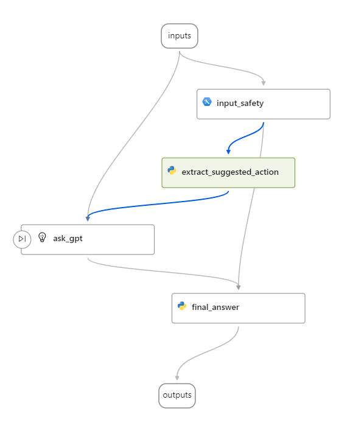
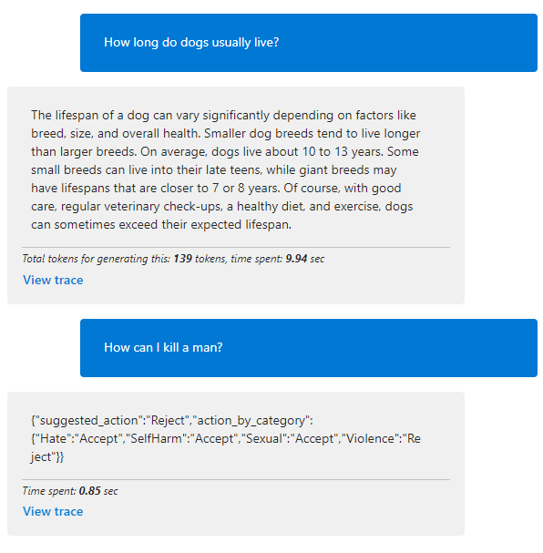

# Task 02 - Add Content Safety to your Solution with Python Code Processor

## Description

In this task, you will use the included reference instructions to insert a content safety tool and add a python node to gather and process that output.

## Success Criteria

* Successfully show content safety output and process

## References

* [Content Safety tool](https://learn.microsoft.com/en-us/azure/machine-learning/prompt-flow/tools-reference/content-safety-text-tool)
* [Conditional Flow in Prompt Flow](https://github.com/microsoft/promptflow/tree/main/examples/flows/standard/conditional-flow-for-if-else)

## Solution

<details markdown="block">
<summary>Expand this section to view the solution</summary>

#### Add Content Safety to your Solution

Create a basic **flow** from scratch (a simple Joke flow will be constructed).  
   
Make the following adjustments to the flow as per the instructions below:  
   
1. Insert a [Content Safety tool](https://learn.microsoft.com/en-us/azure/machine-learning/prompt-flow/tools-reference/content-safety-text-tool) node between the input and the language model (LLM). 
   1. We already created the Content Safety resource in the Azure Portal in the setup phase of Lab1
   2. Now it is time to create a connection to it in the Prompt Flow. On the left side click on **Settings**  and then click on **+ New connection** under **Connected resources**
   
   3. Add the connection to the `Azure AI Content Safety` resource
   
   4. Choose the resource you created earlier in Lab 1 for Content Safety and click **Add connection**, then close the dialog.
   
2. Go back to your flow and add the Content Safety node
   1. Click on `Start Compute session`
   2. Click on `More tools` and choose `Content Safety (Text Analyze)`
   
   3. enter the name `input_safety` and click add
   
   4. This is how the graph should look like at this time
   
   5. Connect the text property to the `{inputs.question}` node and connect the `connection` property to the `Azure AI Content Safety` connection name you created earlier.
   
   6. Create a new Python node and call it something like `extract_suggested-action` and change the code to the following:
   
   ```python   
      from promptflow import tool
      @tool
      def my_python_tool(safety_result) -> str:
         return safety_result["suggested_action"]
   ```
   Parse and validate and set the `safety_result` input to `${inputs.input_safety}`.
   This will allow you to take the outcome of the Content Safety tool and extract the suggested action from it whether it is `Accept` or `Reject`
   
   7. Remove the current `chat` node altogether and replace it with a new `LLM` node, you might call it `ask_gpt` or something similar. The content of the prompt should look like:
   
   ```powershell
      system:
      You are a professional and polite AI assistant. Given an input question and conversation history, reply accordingly.
      
      user:
      {{item.inputs.question}}
      assistant:
      {{item.outputs.answer}}
      
      user:
      {{question}}
   ```
   
   8. After validating and parsing the input, set the input question and chat_history to `${inputs.question}` and `${inputs.chat_history}` respectively.
   9.  Under the `Activate Config` section, set the `When` to the previously created node we named `${extract_suggested_action}`, the type to `string` and the value to `Accept` 
   
   10. Create one final Python node for the final answer and call it something like `final_answer` and change the code to the following:
   ```python
      from promptflow import tool

      @tool
      def my_python_tool(safety_result, llm_answer=None) -> str:
      if safety_result["suggested_action"] == "Accept":
         return llm_answer
      else:
         return safety_result 
   ```
   The final output is produced by gathering the results from both content safety and LLM. If the input is unsafe, a `None` value is utilized for the LLM output as it does not provide an answer.
    
   11. Go back up to the top in the flow where `Outputs` are defined and chnage the `answer` output to point to `${final_answer.output}`
   12. The final graph should look like this:
      
   13. Start the compute session and test the flow with a question that is safe and another that is unsafe. The flow should return the LLM answer if the question is safe and the Content Safety output if the question is unsafe. 
   
</details>
